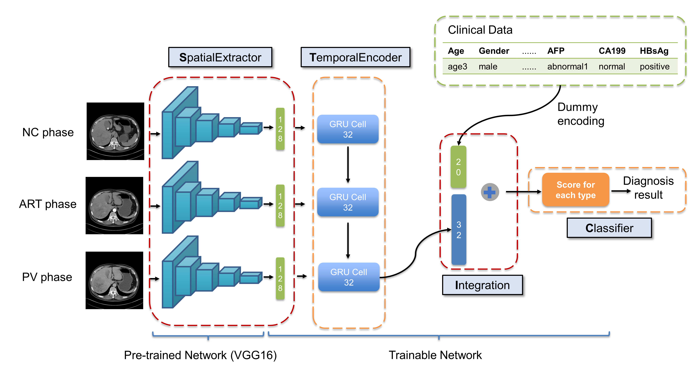

## *SpatialExtractor-TemporalEncoder-Integration-Classifier*

Source code for SpatialExtractor-TemporalEncoder-Integration-Classifier (STIC) model.

<p align="center">
     <br />
    <em> The schematics of the proposed STIC model</em>
</p>


### System requirement

Major dependencies are:

- python 3.6
- pydicom 2.0.0
- matplotlib 3.3.1
- pillow 7.2.0
- tensorflow-gpu 1.12.0
- keras 2.2.4


### Preprocessing

Code in **./preprocessing**

#### For CECT

Directory structure for saving multi-phase CECT DICOM files:

```bash
CECT
└───patient1
│  └───Dicom
│    │  NC.dcm
│    │  ART.dcm
│    │  PV.dcm
│  
└───patient2
│  └───Dicom
│    │  NC.dcm
│    │  ART.dcm
│    │  PV.dcm
│  ...
```

##### 1. CT HU value conversion 

```bash
cd preprocessing
python CT_HU_conversion.py
```

##### 2. Multi-phase CT affine registration

Dependencies are:

- AirLab: autograd image registration laboratory^[1]^
- torch 1.7.1
- simpleitk 2.0.2
```bash
git clone https://github.com/airlab-unibas/airlab.git
python CT_affine_registration.py
```

##### 3. Merge three phase CECT images into one RGB file
```bash
python CT_multi_merge.py
```

Directory structure after CECT preprocessing:
```bash
CECT
└───patient1
│   └───Dicom
│   |   │   NC.dcm
│   |   │   ART.dcm
│   |   │   PV.dcm
│   | 
│   └───PNG
│   |   │   NC.png
│   |   │   ART.png
│   |   │   PV.png
│   | 
│   └───Registration
│   |   │   NC.png
│   |   │   ART.png
│   |   │   PV.png
│   | 
│   └───RGB
│       │   patient1.png
│   
└───patient2
│   ...
```

#### For clinical data

##### 1. Mapping clinical data to categorical variables
```bash
python clinical_mapping.py
```

Mapped clinical data is save in .csv file.


### Training

Directory structure for training and test data:

```bash
Data folder
└───ClinicalData
│   │   clinicalTrain.csv
│   │   clinicalTest.csv
│   
└───CECT
│   └───Train
│   |   │   patientID1.png
│   |   │   patientID2.png
│   |   │   ...
│   | 
│   └───Test
│   |   │   patientID1.png
│   |   │   patientID2.png
│   |   │   ...
```


Code in **./training**

1. ```CNN_RNN_data.py```: it defines functions for loading multi-phase CECT images and clinical data of training set.
2. ```CNN_RNN_model.py```:  it defines functions for STIC model, Naive RGB model, and Naive joint model.
3. ```HI_naive_main.py```:  it trains Naive RGB model for classifying HCC and ICC.
4. ```HI_joint_main.py```:  it trains Naive joint model for classifying HCC and ICC.
5. ```HI_STIC_mian.py```:  it trains STIC model for classifying HCC and ICC.
6. ```HIM_STIC_main.py```:  it trains STIC model for classifying HCC, ICC and metastasis.

**NVIDIA Tesla V100** with 32GB of memory for each GPU is used to accelerate training. 

Trained models are saved in **./model**


### Testing

Code in **./testing**

1. ```CNN_RNN_data.py```: it defines functions for loading multi-phase CECT images and clinical data of test set.
2. ```HI_naive_test.py```:  it evaluates Naive RGB model for classifying HCC and ICC on the test set.
3. ```HI_joint_test.py```:  it evaluates Naive joint model for classifying HCC and ICC on the test set.
4. ```HI_STIC_test.py```:  it evaluates STIC model for classifying HCC and ICC on the test set.
5. ```HIM_STIC_test.py```:  it evaluates STIC model for classifying HCC, ICC and metastasis on the test set.


### Prediction 

Code in **./prediction**

Predicting scores of three types of malignant liver tumors using **STIC model** (This can be done on **CPU** devices without NVIDIA GPU).

##### Input

It takes directory saving CECT and clinical data after preprocessing as input.

##### Output

It output scores predicted by STIC model in .csv format, STIC_predicting.log is the log file.

##### Run

```bash
python STIC_predicting.py mode input_path output_name -predictionID
```

- ```mode```:  ```single``` or ```multiple```

  -  ```single```  mode predicts the score of one specific sample.
  - ```multiple``` mode predicts the scores of many samples in one directory.
- ```input_path```: folder path where the data to be predicted is stored.
- ```output_name```: name of file storing predicting scores (filename extension is not required).
- ```-predictionID```: Patient ID to be predicted (only needed for ```single```  mode).

##### Example

```single```  mode : 

```bash
python STIC_predicting.py single ../data test -predictionID=1
```

```multiple``` mode :

```bash
python STIC_predicting.py multiple ../data test_multiple
```


### Reference

[1] Sandkühler R, Jud C, Andermatt S, Cattin PC. AirLab: autograd image registration laboratory. ArXiv Prepr ArXiv180609907 2018.